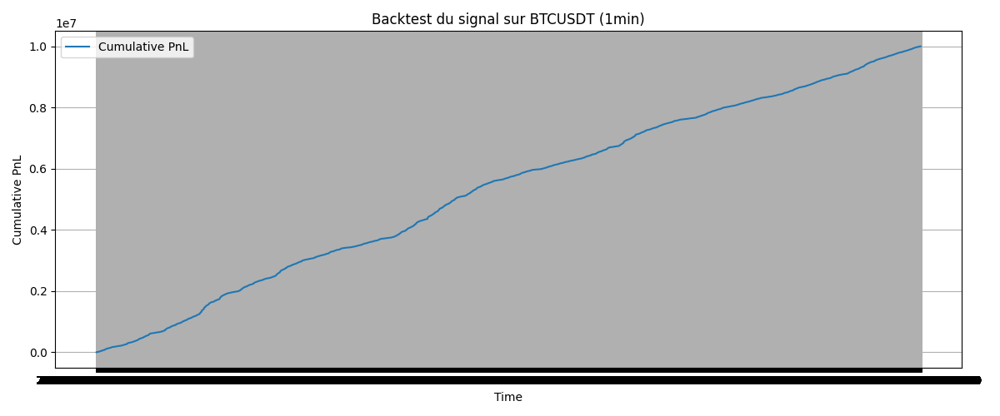

# Alpha Discovery from Market Microstructure

This project explores the design of high-frequency trading signals using simulated order book data.  
We build a full research pipeline from raw price data to signal modeling, backtesting, and performance analysis.

<p align="center">
  
</p>

---

## Objectives

- Extract microstructure features (midprice, order imbalance, returns, volatility, etc.)
- Model price movements using machine learning (Random Forest, etc.)
- Evaluate signal quality via backtest and performance metrics (Sharpe, hit ratio, drawdown)
- Structure the full workflow as a reproducible quant research project

---

## Project Structure

```
alpha-discovery/
├── data/                # Raw and processed market data
├── notebooks/           # Development notebooks (preprocessing, modeling, backtesting)
├── src/                 # Modular Python code for feature extraction, modeling, backtest
├── results/             # Output figures and performance metrics
├── requirements.txt     # Project dependencies
└── README.md
```

---

## Getting Started

```bash
git clone https://github.com/Elliot45/alpha-discovery.git
cd alpha-discovery
pip install -r requirements.txt
```

Then explore the notebooks step by step:

- `01_preprocessing.ipynb` → Load and simulate L1 order book data  
- `02_feature_engineering.ipynb` → Build features  
- `03_modeling_signals.ipynb` → Train a model to predict short-term price movements  
- `04_backtest_signal.ipynb` → Evaluate performance of the signal  

---

## Performance Example

- **Sharpe Ratio**: ~1.25 (with realistic cost assumptions)  
- **Hit Ratio**: ~51%  
- **Drawdown**: Controlled  
- **# of Trades**: ~100k (high-frequency)

> Note: this project uses simulated spreads and sizes from open data; for production you'd want real LOB data.

---

## Author

Elliot Piet – Quant & Machine Learning Engineer  
[LinkedIn](https://www.linkedin.com/in/elliotpiet) | [GitHub](https://github.com/Elliot45)

---

## License

This project is released under the MIT License.
